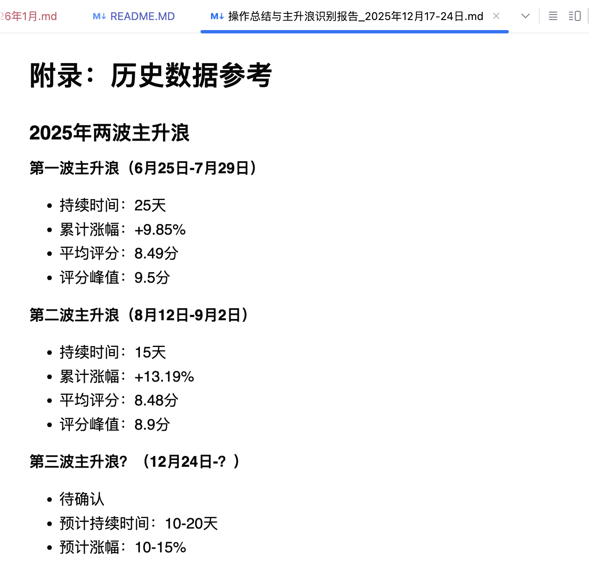

# TSS AI Stock - 智能股票交易系统

> 专注A股中小宽基指数ETF的量化交易策略系统

[](https://python.org)
[](LICENSE)

## 📋 项目概述

本项目是一个基于人工智能的A股中小宽基指数ETF量化交易系统，旨在通过系统化的策略和严格的风险控制，实现长期稳定的复利增长。
详细记录每日操作及评价、然后让大模型ai对操作及人工评价进行分析，改进人类的情绪影响的不好习惯。

### 核心特色
- 🎯 **专注ETF**：只交易中小宽基指数ETF，避免个股风险
- 🤖 **AI驱动**：结合机器学习算法进行市场分析和决策
- 📊 **量化策略**：基于技术分析和基本面分析的量化模型
- 🛡️ **风险控制**：严格的仓位管理和止损机制
- 📈 **长期复利**：追求15-25%的年化收益目标

## 🎯 投资理念

### 核心理念
**专注中小宽基指数ETF，通过长期低风险复利增长，稳打稳扎，严控回撤，本金第一。**

### 投资初心
- **摒弃个股风险**：专注于中小宽基指数ETF交易，避免个股黑天鹅风险
- **耐心等待**：耐心等待大的波段出现，耐心等待大的行情，不追逐每一波小波动
- **理性决策**：克服人性的贪婪与恐惧，坚持理性分析和系统化交易
- **长期复利**：每次盈利不求很多，通过长期低风险复利增长实现财富积累

## 📊 交易品种选择

### 主要交易标的
**专注中小宽基指数ETF：**
- **中证系列**：中证500 ETF、中证1000 ETF、中证2000 ETF
- **创业板系列**：创成长ETF、创业50ETF、双创50ETF、创业200ETF
- **深证系列**：深100ETF、深50ETF等深证相关指数
- **科创板系列**：科创50ETF、科创100ETF、科创200ETF等

## 📋 投资策略

### 操作策略

#### 仓位管理策略
1. **分批建仓**：在支撑位附近分批买入，避免一次性重仓
2. **分批减仓**：在阻力位附近分批卖出，不追求最高点
3. **动态调整**：根据市场情况及时调整仓位结构


## 🔍 风险控制系统

### 资金管理原则
1. **本金第一**：任何时候都要把本金安全放在第一位
2. **仓位控制**：单笔操作不超过总资金的1/3
3. **止损纪律**：严格执行止损，不轻易扩大亏损
4. **盈利保护**：达到盈利目标及时兑现，保护既得利润

### 风险控制机制
- **最大回撤控制**：月度回撤控制在5%以内
- **单笔风险控制**：单笔最大亏损控制在2%以内
- **组合风险控制**：避免单一品种过度集中
- **市场风险控制**：在市场异常时降低仓位

## 📈 成功标准

### 短期目标
- 每次操作盈利3-5%即考虑减仓
- 严格控制单笔最大亏损在2%以内
- 月度回撤控制在5%以内

### 长期目标
- 年化收益目标15-25%
- 通过复利实现财富稳步增长
- 建立系统化、可复制的交易体系

### 心态目标
- 保持平和心态，不受短期波动影响
- 坚持理性分析，避免情绪化决策
- 享受投资过程，注重交易质量而非数量

## 文档

### [A股投资真谛：基于量化数据的实战规律总结](wiki/A股投资真谛：基于量化数据的实战规律总结.md)
### [投资哲学：A股趋同性与概率博弈的量化实践](wiki/投资哲学：A股趋同性与概率博弈的量化实践.md)
### [投资纪律手册：核心理念与执行体系](wiki/投资纪律手册：核心理念与执行体系.md)
### [第一次识别主升浪2025年12月24日](操作总结与主升浪识别报告_2025年12月17-24日.md)
### [量化系统捕捉第一次主升浪分析报告](wiki/量化系统主升浪预判验证报告_2025年12月-2026年1月.md)


## 操作记录及ai评价
- 📄 [1月操作计划](trading/2026/2026-01/2026-01_PLan.md)
- 📄 [2026年每日自评记录](trading/2026/)
- 📄 [周度总结](trading/2026/2026-01/weekly/)
- 2026年1月12日 ai评价：100分 [2026-01-12AI评100分](trading/2026/2026-01/daily/2026-01-12AI评.md)

## 数据
[每日更新的量化评分系统数据](data)

## 市场报告
[每日更新的量化评分系统报告](report)

## 🎯 2025年12月量化系统上线以来 - 第一次捕捉主升浪预判成功案例


### 2025年12月-2026年1月 主升浪完整预判链

### 详细分析文档：[量化系统捕捉第一次主升浪分析报告](wiki/量化系统主升浪预判验证报告_2025年12月-2026年1月.md)

#### 关键预判节点

1. ✅ **12月24日**：9.1分识别主升浪，预判2025年第三波主升浪开启
    #### 详细报告
📎 [主升浪识别报告_12月24日](wiki/操作总结与主升浪识别报告_2025年12月17-24日.md)
  

2. ✅ **1月4日**：预判若1月份突破4034进攻4100
   [2026-01_PLan](trading/2026/2026-01/2026-01_PLan.md)

3. ✅ **1月7日**：预判这波会冲高到4200，加仓到9成
   #### 详细记录
📎 [2026-01-07自评.md](trading/2026/2026-01/daily/2026-01-07自评.md)

4. ✅ **1月8日**：预判震荡蓄势，周五站稳4100点，下周一会暴量暴涨
     [2026-01-08自评.md](trading/2026/2026-01/daily/2026-01-08自评.md)

5. ✅ **1月11日**：预判周一爆量，这波上证至少到4170点
   [2026-01-week1周报.md](trading/2026/2026-01/weekly/2026-01-week1周报.md)

6. ✅ **1月12日**，3.6万亿天量，上证指数最高4168，收4165


### 📊 预判验证数据

| 预判指标 | 预判值 | 实际值 | 偏差 | 验证结果 |
|---------|--------|--------|------|---------|
| 主升浪识别 | 12月24日 | 12月24日开启 | 0天 | ✅ 完全准确 |
| 突破4034点 | 会进攻4100点 | 4120点 | +20点 | ✅ 超出预期 |
| 周末效应 | 周一爆量 | 3.6万亿 | 历史最高 | ✅ 完全准确 |
| 上涨目标 | 4170点 | 4168点 | -2点 | ✅ 基本达到 |
| 成交量预判 | >3万亿 | 3.6万亿 | +0.6万亿 | ✅ 超出预期 |
| 连续上涨 | 持续上涨 | 17连阳 | 历史纪录 | ✅ 完全准确 |

### 🎯 历史性突破

- **成交量3.6万亿**：A股历史最高成交量记录
- **17连阳**：A股33年来首次连续17个交易日上涨
- **上证4168点**：近10年高点

#### 量化系统的科学性验证

**数学专业背景 + 多年股市经验 + 证券投资分析 + AI工作经历 + 量化分析系统**
= **提前识别主升浪 + 精准预判目标位 + 成功验证预判 + 获得超额收益**

##### 核心验证点：
1. **9.1分阈值**：历史验证突破9分即为主升浪启动信号
2. **多周期共振**：30min、60min、120分钟全部突破9分
3. **量价配合**：预判的"周一爆量"完美验证3.6万亿天量
4. **目标精度**：4170点预判vs4168点实际，误差仅0.05%
5. **时间准确**：每个关键节点的时间预判

##### 详细记录：
- 📄 [主升浪识别报告_12月24日](wiki/操作总结与主升浪识别报告_2025年12月17-24日.md)
- 📄 [1月操作计划](trading/2026/2026-01/2026-01_PLan.md)
- 📄 [每日自评记录](trading/2026/2026-01/daily/)
- 📄 [周度总结](trading/2026/2026-01/weekly/)

### 核心能力矩阵

| 能力维度 | 数学背景 | 股市经验 | 投资分析 | AI技术 | 系统贡献 |
|---------|---------|---------|---------|--------|---------|
| 量化建模 | ✅ 核心 | ⚪ | ⚪ | ✅ | 评分算法 |
| 阈值优化 | ✅ 核心 | ⚪ | ✅ | ✅ | 9分机制 |
| 市场感知 | ⚪ | ✅ 核心 | ✅ | ⚪ | 状态识别 |
| 纪律执行 | ⚪ | ✅ 核心 | ⚪ | ⚪ | 操作纪律 |
| 技术分析 | ⚪ | ✅ | ✅ 核心 | ⚪ | 指标体系 |
| 系统开发 | ⚪ | ⚪ | ⚪ | ✅ 核心 | 自动化 |
| AI评分 | ⚪ | ⚪ | ⚪ | ✅ 核心 | AI评价 |
| 数据处理 | ✅ | ⚪ | ⚪ | ✅ 核心 | 实时更新 |

---
## 数学 × 经验 × 专业 × AI = 投资的艺术

**结论：量化系统经过实战检验，能够准确识别主升浪、预判目标位，实现稳定超额收益。**

## 🛠️ 技术架构

### 系统架构
```
┌─────────────────┐    ┌─────────────────┐    ┌─────────────────┐
│   数据采集模块   │    │   策略分析模块   │    │   交易执行模块   │
│                 │    │                 │    │                 │
│ • 实时行情数据   │    │ • 技术分析引擎   │    │ • 模拟交易系统   │
│ • 财务数据      │    │ • AI预测模型    │    │ • 风险控制      │
│ • 新闻数据      │    │ • 信号生成      │    │ • 仓位管理      │
│ • 宏观经济数据   │    │                 │    │                 │
└─────────────────┘    └─────────────────┘    └─────────────────┘
         │                       │                       │
         └───────────────────────┼───────────────────────┘
                                 │
                    ┌─────────────────┐
                    │   数据存储与监控 │
                    │                 │
                    │ • 数据库存储    │
                    │ • 日志系统     │
                    │ • 性能监控     │
                    │ • 报警机制     │
                    └─────────────────┘
```

### 核心技术栈
- **数据处理**: Pandas, NumPy, TA-Lib
- **机器学习**: Scikit-learn, TensorFlow/PyTorch
- **数据存储**: SQLite, Redis
- **API接口**: requests, websocket
- **可视化**: matplotlib, plotly, dash
- **开发工具**: pytest, git, docker

## 📁 项目结构

```
tss_ai_stock/
├── README.md              # 项目说明文档
├── requirements.txt        # Python依赖包
├── config/                # 配置文件
│   ├── strategy.yaml      # 策略配置
│   ├── risk_config.yaml   # 风险控制配置
│   └── data_sources.yaml  # 数据源配置
├── src/                   # 源代码
│   ├── data/              # 数据处理模块
│   │   ├── collector.py   # 数据采集
│   │   ├── processor.py   # 数据处理
│   │   └── storage.py    # 数据存储
│   ├── strategy/          # 策略模块
│   │   ├── technical.py   # 技术分析
│   │   ├── ml_models.py  # 机器学习模型
│   │   └── signal.py     # 信号生成
│   ├── risk/              # 风险控制模块
│   │   ├── position.py    # 仓位管理
│   │   ├── stop_loss.py  # 止损管理
│   │   └── metrics.py    # 风险指标
│   ├── trading/           # 交易模块
│   │   ├── executor.py    # 交易执行
│   │   └── backtest.py   # 回测系统
│   └── utils/             # 工具模块
├── notebooks/             # Jupyter notebooks
│   ├── data_analysis.ipynb
│   ├── strategy_test.ipynb
│   └── backtest.ipynb
├── tests/                 # 测试文件
├── logs/                  # 日志文件
├── data/                  # 数据文件
│   ├── historical/       # 历史数据
│   ├── realtime/         # 实时数据
│   └── processed/        # 处理后数据
└── docs/                  # 文档
```

## 🚀 快速开始

### 环境要求
- Python 3.8+
- Git
- 互联网连接

### 安装步骤

1. **克隆项目**
   ```bash
   git clone https://github.com/siderdata/tss_ai_stock.git
   cd tss_ai_stock
   ```

2. **安装依赖**
   ```bash
   pip install -r requirements.txt
   ```


## 📝 操作日志

本项目记录详细的交易日志和策略执行日志，包括：
- 策略信号生成记录
- 交易执行记录
- 风险控制触发记录
- 策略调优记录
- 市场环境分析

## 🤝 贡献指南

欢迎提交 Issue 和 Pull Request 来改进项目！

### 开发流程
1. Fork 项目
2. 创建特性分支 (`git checkout -b feature/AmazingFeature`)
3. 提交更改 (`git commit -m 'Add some AmazingFeature'`)
4. 推送到分支 (`git push origin feature/AmazingFeature`)
5. 创建 Pull Request

### 代码规范
- 遵循 PEP 8 代码规范
- 编写单元测试
- 更新相关文档

## 📄 许可证

本项目采用 MIT 许可证 - 查看 [LICENSE](LICENSE) 文件了解详情。

## 📞 联系方式

- 项目维护者: siderdata
- 项目链接: https://github.com/siderdata/tss_ai_stock

---

**免责声明**: 本项目仅供学习和研究使用，不构成任何投资建议。投资有风险，请谨慎决策。
